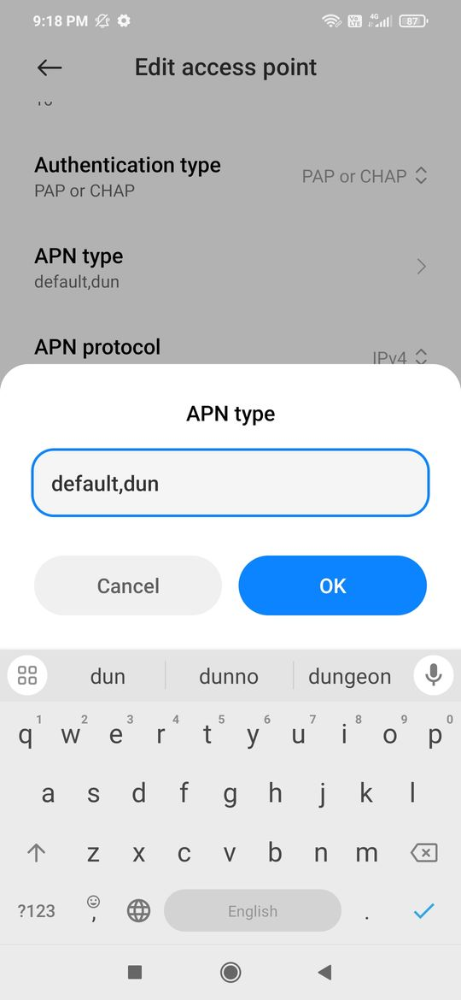

- Open **Settings** > **SIM cards & mobile networks**.
- Select your SIM provider under **Sim Card Settings**.
- Tap **Access Point Names (APN)**.
- Select your current APN under **General**.
- Scroll to **APN type** and add `,dun` at the end.
- Save the changes.
- Turn your hotspot off and then back on.
- (Optional) Restart your phone if the hotspot still doesn’t work.

